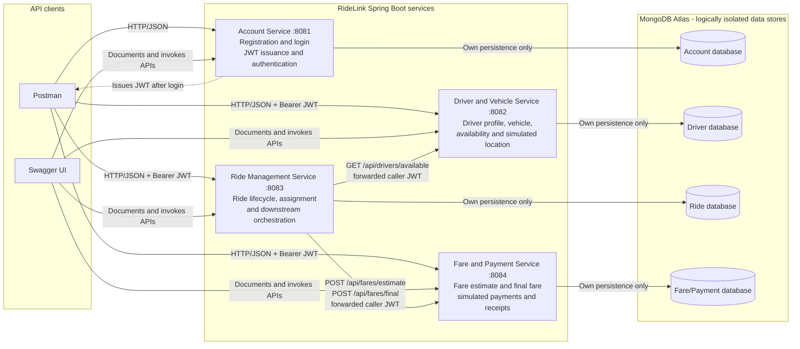
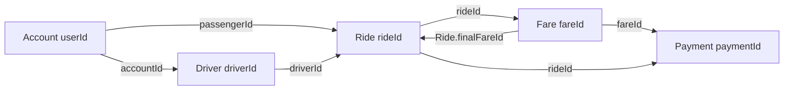
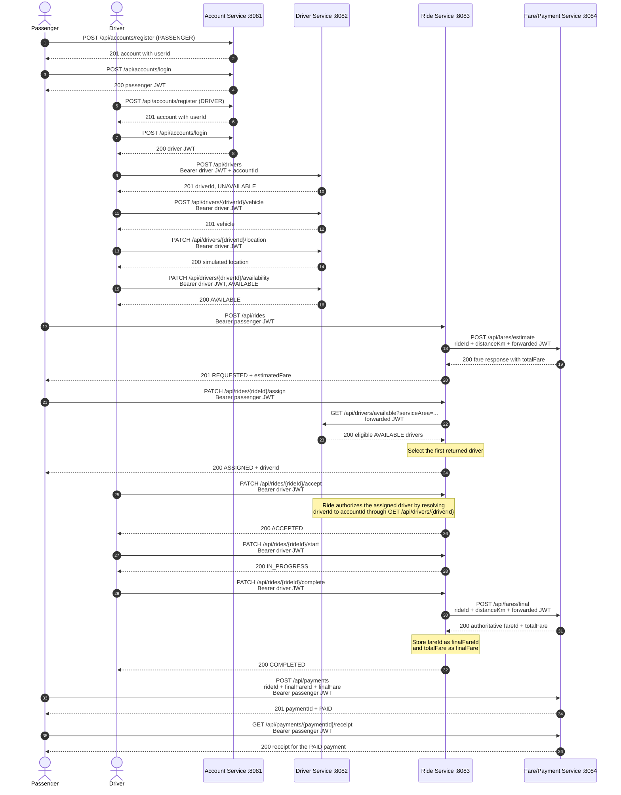
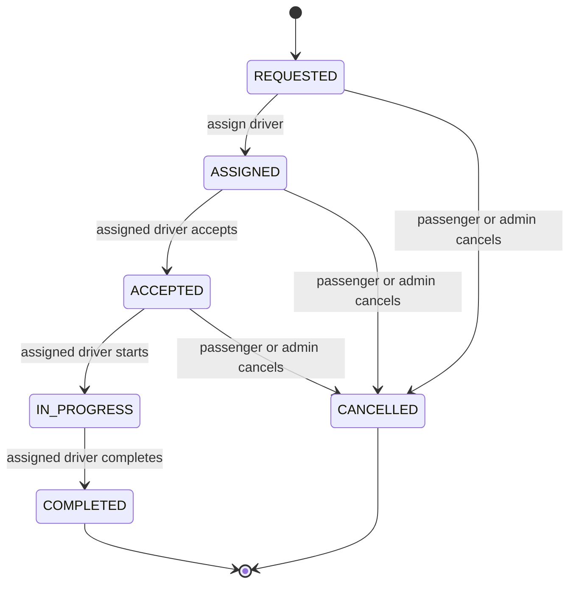
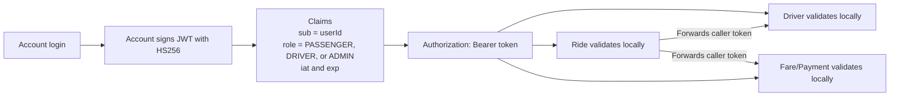
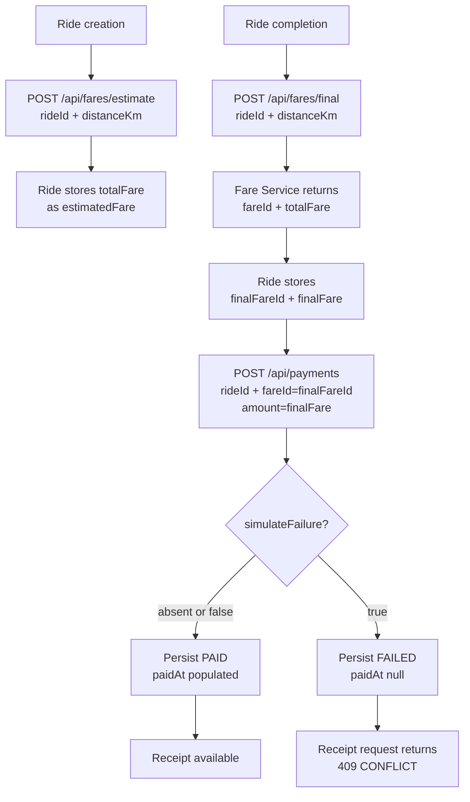
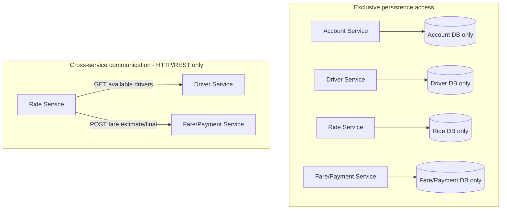
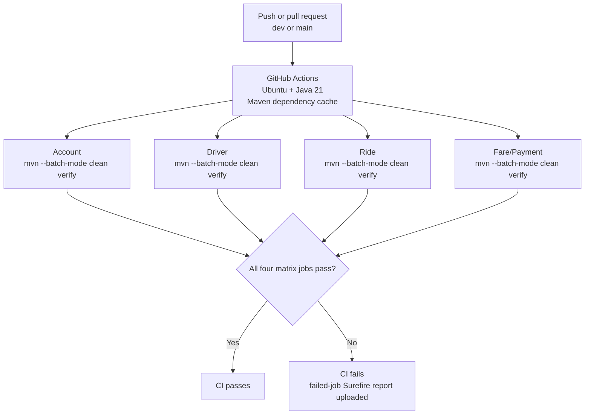

# RideLink Architecture

This document describes the architecture implemented in the current RideLink backend. RideLink consists of four independently deployable Spring Boot services that communicate through synchronous HTTP/JSON APIs and own separate MongoDB data stores.

## 1. System architecture



The Account Service is the only JWT issuer. Driver, Ride, and Fare/Payment do not call Account to authenticate a request; each validates the signed JWT locally using the shared runtime signing secret. Ride forwards the caller's bearer token when it calls Driver or Fare/Payment.

## 2. Service ownership and stable identifiers

| Service | Owned identifiers and data | External stable references held |
| --- | --- | --- |
| Account | `userId`, account/profile, role, account status, credentials and password hash | None |
| Driver & Vehicle | `driverId`, `vehicleId`, driver profile, vehicle, availability, simulated location, `serviceArea` | `accountId` references Account `userId` |
| Ride | `rideId`, lifecycle state, pickup/drop-off data, distance, `estimatedFare`, `finalFare` | `passengerId` references Account `userId`; `driverId` references Driver `driverId`; `finalFareId` references Fare/Payment `fareId` |
| Fare & Payment | `fareId`, fare calculations, `paymentId`, payment status and receipt data | `rideId` references Ride `rideId` |



These arrows represent stable string identifiers exchanged through REST DTOs, not database relationships. No service imports another service's persistence entity, repository, collection, or database connection.

## 3. Happy-path sequence



The Driver ownership check compares the JWT `sub` (Account `userId`) with the Driver profile's `accountId`; it does not incorrectly compare the Account `userId` with the distinct `driverId`.

## 4. Ride state machine



`COMPLETED` and `CANCELLED` are terminal states. A lifecycle request that does not match an allowed transition returns `409 CONFLICT` and does not advance the ride.

## 5. Security flow



- All four services use the same `JWT_SECRET` value at runtime.
- The secret is read as UTF-8 and must contain at least 32 bytes for HS256.
- The secret is supplied through the environment and is never committed to the repository.
- Account issues tokens with `sub = userId`, a `role` claim containing `PASSENGER`, `DRIVER`, or `ADMIN`, and an expiration.
- Driver, Ride, and Fare/Payment verify the signature and expiration locally. They do not query Account during authentication.
- Authorities are represented as `ROLE_PASSENGER`, `ROLE_DRIVER`, and `ROLE_ADMIN` inside Spring Security.
- Missing, malformed, invalid, or expired credentials produce `401 UNAUTHENTICATED`.
- A valid token without the required role or resource ownership produces `403 FORBIDDEN`.
- Registration, login, and the intentionally public Swagger/OpenAPI paths do not require a bearer token. Business endpoints retain their contracted authentication and authorization rules.

## 6. Fare and payment flow

The Fare/Payment Service owns fare calculation and persists both estimated and final fare records. Its configured calculation is:

```text
fare = baseFare + (distanceKm * ratePerKm)
```



`finalFareId` is an external stable identifier owned and generated by Fare/Payment. It is `null` in Ride before successful final-fare calculation. Ride never generates a replacement fare ID. Payment creation validates that the referenced fare exists even when failure simulation is requested.

## 7. Database isolation



The service-to-database arrows above are deliberately one-to-one. Cross-service references remain string IDs in service-owned documents; they are not MongoDB joins, foreign-key constraints, shared collections, or repository access.

## 8. Deployment and local development

| Service | Local address | Persistence setting |
| --- | --- | --- |
| Account | `http://localhost:8081` | `ACCOUNT_MONGODB_URI` |
| Driver & Vehicle | `http://localhost:8082` | `DRIVER_MONGODB_URI` |
| Ride | `http://localhost:8083` | `RIDE_MONGODB_URI` |
| Fare & Payment | `http://localhost:8084` | `PAYMENT_MONGODB_URI` |

MongoDB Atlas is the external persistence platform, with a logically isolated database configured for each service. Runtime configuration uses these environment-variable names without embedding values in source control:

| Environment variable | Purpose |
| --- | --- |
| `ACCOUNT_MONGODB_URI` | Account-owned MongoDB connection |
| `DRIVER_MONGODB_URI` | Driver-owned MongoDB connection |
| `RIDE_MONGODB_URI` | Ride-owned MongoDB connection |
| `PAYMENT_MONGODB_URI` | Fare/Payment-owned MongoDB connection |
| `JWT_SECRET` | Shared JWT signing and validation secret |
| `DRIVER_SERVICE_URL` | Driver base URL used by Ride; defaults locally to port 8082 |
| `FARE_PAYMENT_SERVICE_URL` | Fare/Payment base URL used by Ride; defaults locally to port 8084 |

No API Gateway, service registry, message broker, container platform, frontend, Redis, or gRPC component is required by this implementation.

## 9. Continuous integration



The workflow uses a four-entry matrix, Temurin Java 21, Maven caching, and `mvn --batch-mode clean verify` from each service directory. Every matrix job must pass. Surefire reports are uploaded only for failed jobs.

Current automated test totals, derived from the repository's generated Surefire reports after successful `clean verify` runs, are:

| Matrix service | Tests | Failures | Errors | Skipped |
| --- | ---: | ---: | ---: | ---: |
| Account | 86 | 0 | 0 | 0 |
| Driver | 102 | 0 | 0 | 0 |
| Ride | 90 | 0 | 0 | 0 |
| Fare/Payment | 72 | 0 | 0 | 0 |
| **Total** | **350** | **0** | **0** | **0** |

CI uses a clearly fake test-only JWT secret that meets the minimum key length. It does not use Atlas credentials, start the services, or require external RideLink services.

## 10. Current implementation boundaries

- Driver assignment intentionally selects the first available driver returned for an exact `serviceArea` match; there is no geospatial ranking or dispatch optimization.
- The Ride implementation currently uses the ride's `pickupLocation` value as the Driver `serviceArea` query value, so demonstrated data must use matching area names.
- Payments are deterministic simulations (`PAID` or `FAILED`); no external payment provider is integrated.
- JWT trust uses one shared symmetric runtime secret. There is no identity-provider discovery or automated key rotation in the assignment scope.
- The APIs provide no cross-service transaction coordinator. Each service protects its own consistency boundary and communicates synchronously over REST.
